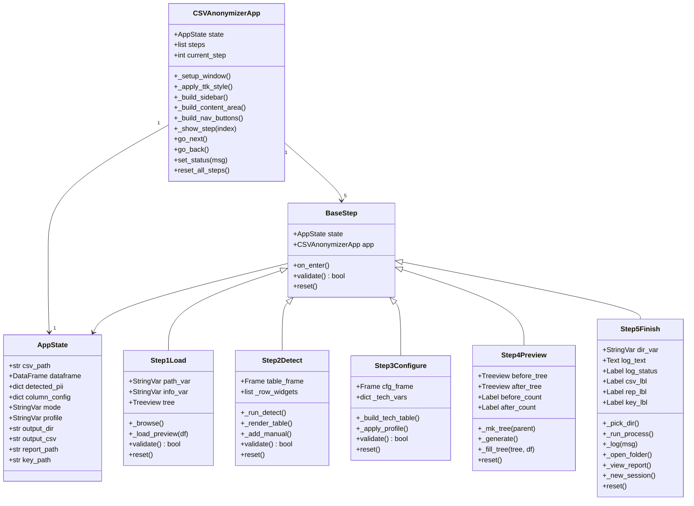
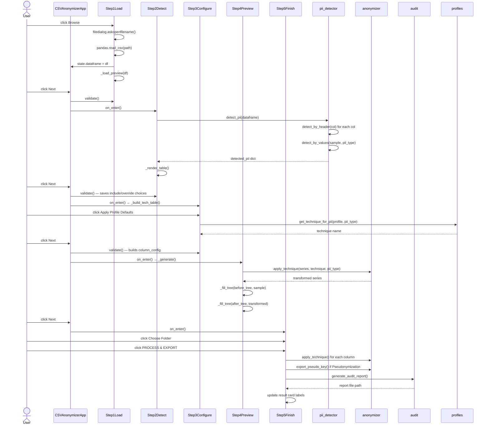
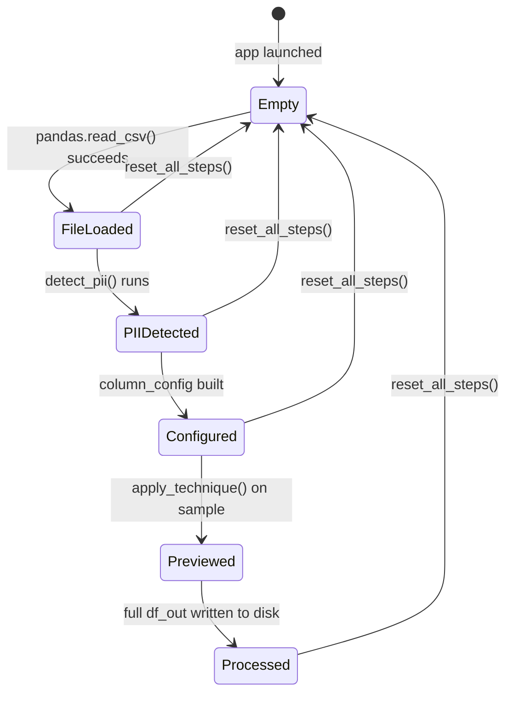
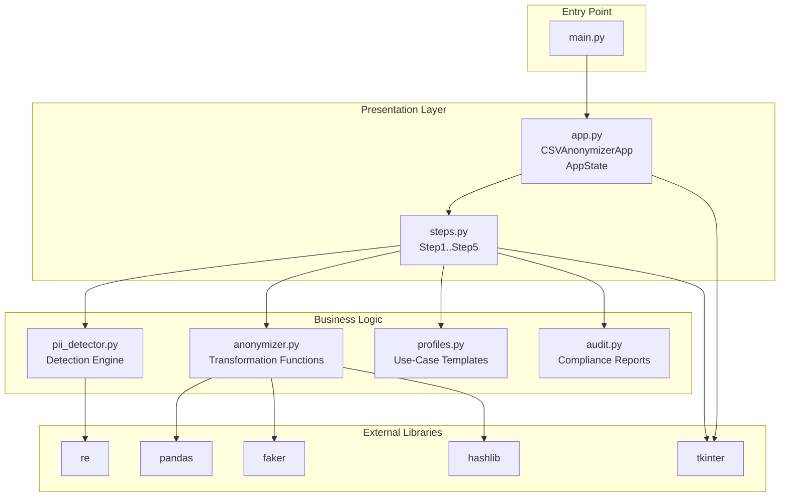

# CSV Anonymizer — Code Explanation & UML Reference

---

## 1. System Overview

The application is a **5-step Tkinter wizard** split across 7 Python modules. Data flows in one direction through the wizard; the `AppState` object acts as a shared memory bus accessible by all steps.

```
main.py
  └─ app.py  (CSVAnonymizerApp + AppState)
       ├─ steps.py        (all 5 wizard UI frames)
       ├─ pii_detector.py (detection engine)
       ├─ anonymizer.py   (transformation functions)
       ├─ profiles.py     (profile templates)
       └─ audit.py        (report generator)
```

---

## 2. UML Class Diagram (Mermaid)



---

## 3. UML Sequence Diagram — Happy Path



---

## 4. Data Flow Diagram

```
CSV File (disk)
      │
      ▼
pandas.read_csv()
      │
      ▼
AppState.dataframe  (pd.DataFrame)
      │
      ├──▶ pii_detector.detect_pii()
      │          │
      │          ├── detect_by_header(col_name)
      │          │       └── keyword match in PII_DEFINITIONS
      │          │
      │          └── detect_by_values(sample_values, pii_type)
      │                  └── re.search(pattern, value)
      │
      ▼
AppState.detected_pii  { col: {pii_type, method, default_tech, include} }
      │
      ▼ (user adjustments in Step 2 & 3)
AppState.column_config { col: {pii_type, technique, include} }
      │
      ▼
anonymizer.apply_technique()
      │
      ├── apply_masking()       → regex / slice replacement
      ├── apply_hashing()       → hashlib.sha256().hexdigest()
      ├── apply_generalization()→ age bands / year extraction / IP truncation
      ├── apply_fake_data()     → Faker() with _pseudo_mapping cache
      └── apply_deletion()      → empty string or [REDACTED]
      │
      ▼
df_out (transformed DataFrame)
      │
      ├──▶ df_out.to_csv()              → anonymized_*.csv
      ├──▶ export_pseudo_key()          → pseudo_key_*.json (optional)
      └──▶ generate_audit_report()      → audit_report_*.txt
```

---

## 5. State Machine — AppState Lifecycle



---

## 6. Module-by-Module Function Reference

---

### 6.1 `main.py`

**Purpose:** Entry point. Creates Tkinter root window and starts event loop.

| Element | Type | Description |
|---------|------|-------------|
| `root` | `tk.Tk` | The single top-level Tkinter window |
| `CSVAnonymizerApp(root)` | Constructor call | Builds the entire UI and wires all components |
| `root.mainloop()` | Method call | Blocks until the window is closed; drives all Tkinter events |

---

### 6.2 `app.py`

#### `AppState.__init__(self)`
Initializes all shared session variables to `None` / empty. Two fields (`mode`, `profile`) are Tkinter `StringVar` objects because they are bound directly to radio buttons and comboboxes in the UI — this means changes update the widget automatically without extra code.

#### `CSVAnonymizerApp.__init__(self, root)`
Orchestrates startup: calls `_setup_window()`, `_build_sidebar()`, `_build_content_area()`, `_build_nav_buttons()`, then shows Step 1.

#### `_setup_window(self)`
Sets window title, size (`1100×720`), minimum size (`700×520` — prevents layout collapse), enables resizing, and calls `_apply_ttk_style()`.

#### `_apply_ttk_style(self)`
Configures the `clam` ttk theme with custom colours for: `Treeview` rows and headings, scrollbars, comboboxes, and separators. Called once at startup — affects all ttk widgets application-wide.

#### `_build_sidebar(self)`
Creates the 200px-wide left panel containing the app logo, step indicator labels, and compliance badges. Step labels are stored in `self.step_labels[]` so `_show_step()` can re-colour the active one.

#### `_build_content_area(self)`
Imports and instantiates all 5 step frames. Uses `frame.place(x=0, y=0, relwidth=1, relheight=1)` so all frames occupy the same space — `tkraise()` switches which one is visible.

#### `_build_nav_buttons(self)`
Creates the bottom bar with Back/Next buttons and a status label bound to `self.status_var`.

#### `_show_step(self, index)`
1. Calls `steps[index].tkraise()` to bring the frame to front
2. Calls `steps[index].on_enter()` so the step can refresh its content
3. Updates sidebar label highlight colours
4. Enables/disables Back button; changes Next button text to "Finish" on last step

#### `go_next(self)`
Calls the current step's `validate()`. If it returns `True`, increments `current_step` and calls `_show_step()`.

#### `go_back(self)`
Decrements `current_step` and calls `_show_step()` — no validation needed going backwards.

#### `reset_all_steps(self)`
**The session reset function.** Resets all `AppState` data fields in-place (preserving `StringVar` object references to avoid breaking Tkinter widget bindings), then calls `step.reset()` on each frame to clear visible widgets, then navigates to Step 1.

---

### 6.3 `pii_detector.py`

#### `PII_DEFINITIONS` (module-level dict)
Defines 10 PII types. Each entry contains:
- `header_keywords`: list of strings to match against column names
- `pattern`: compiled regex string for value-level matching
- `default_tech`: suggested anonymization technique

#### `detect_by_header(column_name) → str | None`
Lowercases the column name, then iterates `PII_DEFINITIONS` checking if any keyword is a substring. Returns the first matching PII type name, or `None`.

**Complexity:** O(n × k) where n = number of PII types (10), k = average keywords per type (~5). Effectively constant.

#### `detect_by_values(sample_values, pii_type) → bool`
Applies `re.search(pattern, value)` to each sample value. Returns `True` if ≥ 50% of non-empty samples match. The 50% threshold is a deliberate design choice: high enough to avoid false positives from incidental pattern matches, low enough to catch real PII even in partially-filled columns.

#### `detect_pii(dataframe, sample_rows=10) → dict`
**Main detection function.** Iterates every column, runs Pass 1 (header), then Pass 2 (values) if Pass 1 fails. Returns a dict: `{ column_name: { pii_type, method, default_tech, include } }`. The `method` field ("header" or "value") is displayed in the UI to inform the user how detection occurred.

#### `get_pii_type_names() → list`
Returns sorted list of all PII type names — used to populate dropdown menus.

#### `get_default_technique(pii_type) → str`
Returns the `default_tech` for a given PII type, falling back to `"Masking"` for unknown types.

---

### 6.4 `anonymizer.py`

All transformation functions share the same contract:
```python
def apply_X(series: pd.Series, ...) -> pd.Series
```
This uniformity enables the dispatcher to call any technique with the same interface.

#### `apply_masking(series, pii_type) → pd.Series`
Inner function `mask_value(value)` handles three type-specific cases plus a generic fallback:
- **Email**: splits at `@`, masks all chars after the first in the local part
- **Phone**: strips non-digits, keeps first 3 and last 3, masks middle
- **Credit Card**: keeps last 4 digits only (industry standard)
- **Generic**: keeps first and last character, replaces middle with `*`

#### `apply_hashing(series) → pd.Series`
`hashlib.sha256(str(value).encode("utf-8")).hexdigest()` — always produces a 64-character hex string. The same input always produces the same output (deterministic), but the function is computationally one-way. Used for IDs that need consistent joining across datasets without exposing the raw value.

#### `apply_generalization(series, pii_type) → pd.Series`
Dispatches to one of four inner functions based on PII type:
- **Age**: `(age // 10) * 10` → decade band (e.g., `23 → "20-29"`)
- **Date of Birth**: regex extracts 4-digit year (e.g., `"15/03/1990" → "1990"`)
- **IP Address**: replaces 3rd and 4th octets with `x` (e.g., `"192.168.1.5" → "192.168.x.x"`)
- **Address**: splits on commas, returns last segment (city/country level)

#### `apply_fake_data(series, pii_type, locale) → pd.Series`
Uses the `Faker` library with a fixed seed (42) for reproducibility. The module-level `_pseudo_mapping` dict ensures **referential consistency**: the same original value always maps to the same fake value within a session (critical for maintaining row-level integrity across foreign key relationships).

Faker is imported lazily (inside the function) to give a friendly `ImportError` message if not installed, rather than crashing at startup.

#### `apply_deletion(series, mode) → pd.Series`
- `mode="null"`: replaces with `""` (CSV null equivalent)
- `mode="redacted"`: replaces with `"[REDACTED]"` (explicit removal marker)

#### `apply_technique(series, technique, pii_type) → pd.Series`
**Central dispatcher.** A simple `if/elif` chain routing `technique` string to the correct function. Adding a new technique requires: (1) writing the function, (2) adding it to `TECHNIQUE_NAMES`, (3) adding one `elif` branch here.

#### `export_pseudo_key(output_path, input_file, columns_processed) → str`
Writes the pseudonymization mapping to a JSON file with three sections: metadata, a security warning string, and the mapping dict. Returns the path. The warning is embedded directly in the JSON so anyone who opens the file immediately sees the security requirement.

#### `get_pseudo_mapping() / clear_pseudo_mapping()`
Getter returns a copy (preventing external mutation). `clear_pseudo_mapping()` resets the module-level dict — called at the start of every processing run to prevent cross-session contamination.

---

### 6.5 `profiles.py`

#### `PROFILES` (module-level dict)
Three profiles: `Academic/Research`, `Corporate/HR`, `Healthcare`. Each defines:
- `techniques`: `{ pii_type: recommended_technique }` — overrides global defaults for this domain context
- `priority_pii`: which PII types are most important in this domain
- `compliance`: list of applicable frameworks

#### `get_technique_for_pii(profile_name, pii_type) → str`
Looks up the recommended technique in the profile's `techniques` dict. Falls back to `pii_detector.get_default_technique()` if the PII type isn't specifically configured in the profile.

---

### 6.6 `audit.py`

#### `TECHNIQUE_COMPLIANCE_MAP` (module-level dict)
Maps each of the 6 techniques to specific GDPR articles, PECA sections, HIPAA provisions, and CIA Triad implications. This is the authoritative reference for the compliance matrix section of the audit report.

#### `generate_audit_report(input_file, output_file, mode, profile, column_configs, row_count, output_dir, key_file) → str`
Builds a structured plain-text report in memory as a list of strings, then joins and writes to a timestamped file. Sections:

| Section | Content |
|---------|---------|
| A — Processing Summary | Timestamps, file names, mode, row/column counts |
| B — Per-Column Details | Table: column → PII type → technique → status |
| C — Compliance Matrix | For each used technique: GDPR, PECA, HIPAA, CIA Triad mappings |
| D — Mode Notes | Anonymization vs. pseudonymization specific guidance |
| E — Ethical Disclaimer | Legal frameworks, professional conduct principles |

---

### 6.7 `steps.py`

#### `BaseStep(tk.Frame)`
Abstract base class. All step frames inherit from it. Three hook methods:
- `on_enter()`: called when the step becomes active — used to refresh content
- `validate()`: called before advancing — returns `False` to block navigation
- `reset()`: called by `reset_all_steps()` — clears all visible widget state

#### `Step1Load`
- **`_browse()`**: Opens `filedialog.askopenfilename()`. On success: stores path and DataFrame in `AppState`, calls `_load_preview()`, updates info label.
- **`_load_preview(df)`**: Populates the Treeview with first 5 rows. Column width is computed as `max(90, min(160, 900 // num_cols))` — wider for few columns, narrower for many.
- **`validate()`**: Checks `state.dataframe is not None`.
- **`reset()`**: Clears path label, info label, and Treeview.

#### `Step2Detect`
- **`_run_detect()`**: Calls `detect_pii(state.dataframe)`, stores result in `state.detected_pii`, calls `_render_table()`.
- **`_render_table()`**: Rebuilds the scrollable grid of rows using `.grid()`. Each row contains: a `Checkbutton` (include/exclude), column name label, detected type label, detection method label, and override `Combobox`.
- **`_add_manual()`**: Opens a `Toplevel` dialog for adding columns not auto-detected.
- **`validate()`**: Reads all checkbox and combobox values back into `state.detected_pii`.

#### `Step3Configure`
- **`_build_tech_table()`**: Called by `on_enter()`. Rebuilds the technique table from `state.detected_pii`, skipping columns where `include=False`.
- **`_apply_profile()`**: Reads profile name from `state.profile`, calls `get_technique_for_pii()` for each column, updates the corresponding `StringVar` in `_tech_vars`.
- **`validate()`**: Builds `state.column_config` from `_tech_vars`, validates at least one column is configured.

#### `Step4Preview`
- **`_mk_tree(parent)`**: Factory method. Creates a Treeview with both vertical and horizontal scrollbars inside a wrapper frame. Returns `(tree, wrapper)`.
- **`_generate()`**: Copies first 5 rows, applies transformations on the copy (not the original), fills both trees. Updates count labels with row count and transformation status including error count.
- **`_fill_tree(tree, df)`**: Computes proportional column widths (`max(80, min(150, 800 // num_cols))`), sets headings, inserts rows.

#### `Step5Finish`
- **Layout**: Two-column grid (`columnconfigure(0, weight=3)` / `columnconfigure(1, weight=2)`) giving the log 60% of width and results 40%.
- **`_run_process()`**: The main processing function. Validates preconditions, clears log and result labels, then: (1) copies DataFrame, (2) clears pseudo mapping, (3) applies each technique column-by-column with live log updates, (4) saves CSV, (5) optionally exports key file, (6) generates audit report. Updates result card labels as each file is saved.
- **`_log(msg)`**: Enables the disabled Text widget, appends message, scrolls to end, disables again, calls `update_idletasks()` to force UI refresh during the processing loop.
- **`reset()`**: Resets dir label, clears log text, resets status badge and all result card labels.

---

## 7. Key Design Decisions

### Why AppState instead of passing parameters?
All 5 steps need access to the same data (loaded DataFrame, detected PII, column config, output paths). Rather than complex parameter passing or a global variable, `AppState` is a single object passed to every step at construction time. This is a simplified form of the **Shared State** pattern — appropriate for a single-session desktop application.

### Why `place()` instead of `pack()` or `grid()` for step frames?
All step frames are placed at `(0,0)` with `relwidth=1, relheight=1`. This makes them all the same size as the content area. `tkraise()` then simply brings one to the front. Alternative (destroying/recreating frames per step) would be slower and lose widget state when going backwards.

### Why module-level `_pseudo_mapping` in anonymizer.py?
Consistency: if "Ali Hassan" appears in 100 rows, all 100 must map to the same fake name. A module-level dict acts as a session cache. `clear_pseudo_mapping()` resets it between processing runs to prevent cross-run contamination.

### Why lazy Faker import?
Importing at function call time (inside `apply_fake_data`) rather than at module level means: if Faker is not installed, the app still loads and runs correctly for all other techniques — only Fake Data fails with a clear error message.

### Why `grid` with `columnconfigure(weight=1)` for the file-path row?
Using `pack(side=LEFT)` with a fixed `width=` on the label caused the label to overflow or be clipped at small window sizes. `grid` with `weight=1` on the label column and `weight=0` on the button column makes the label stretch to fill all available space while the button stays fixed-size.

---

## 8. UML Package Diagram



---

## 9. Error Handling Map

| Location | Error Condition | Handling Strategy |
|----------|----------------|-------------------|
| `Step1Load._browse()` | Invalid CSV, encoding error, permissions | `try/except Exception` → `messagebox.showerror()` |
| `Step2Detect._run_detect()` | Empty DataFrame | Early return; no crash |
| `Step4Preview._generate()` | Transformation error on sample | Catches per-column, stores `[ERROR: ...]` in cell; increments `errors` counter shown in header |
| `Step5Finish._run_process()` | Any processing error | `try/except Exception` → `messagebox.showerror()` + log entry + result label shows "Failed" |
| `apply_fake_data()` | Faker not installed | `try/except ImportError` → raises descriptive `ImportError` with install instruction |
| `apply_technique()` | Unknown technique name | Prints warning, returns original series unchanged |
| `export_pseudo_key()` | Disk full, permissions | Propagates exception to `_run_process()` handler |
